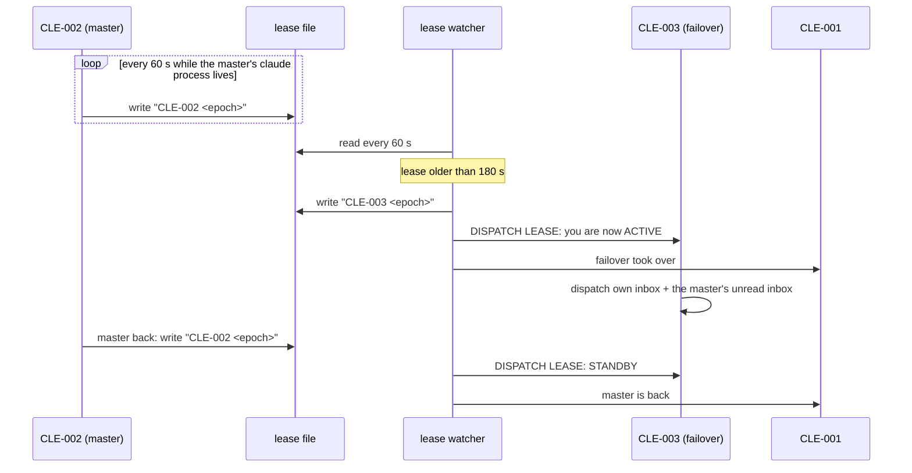

# Spool fleet roles: orchestrator and dispatchers

How the agents that run a box split the work of reading traffic, deciding, and
doing. Owner decision 2026-10-01: the orchestrator stops reading raw traffic;
two dispatchers (a master and a failover) route every message, and only
decisions reach the orchestrator.

## 1. Roles

| id | role | does | never does |
|---|---|---|---|
| `CLE-001` | orchestrator | decides; spawns, re-seats and closes agents; verifies "live" claims; runs the production operations agents' harnesses refuse (prd reads, prd desk and issue writes, deploys the owner pre-approved) | reads the raw message stream; routes routine traffic |
| `CLE-002` | master dispatcher | routes every inbound message to the lane that owns it; delivers agents' owner texts to their topics after checking the claim; escalates decisions to `CLE-001` | codes, commits, deploys, spawns, closes agents, decides |
| `CLE-003` | failover dispatcher | the same as `CLE-002`, but only while it holds the lease (section 4) | dispatches while on standby |
| `CLE-<n>` | lane agents | one brief each: build, test, land, prove live, report to `CLE-001` | route other lanes' traffic |

Every agent runs in **auto** permission mode on the current default model. The
spawner sets `--permission-mode auto`; the model comes from the agent user's
settings, and a relaunch (`restore-claude-plain.sh`) passes it explicitly
because `--resume` keeps the session's old model.

### 1.1 One agent, one discussion

Owner decision 2026-10-01. A lane agent serves **one discussion**: one owner
topic, one bug or one feature. Every live agent costs memory and CPU on the box,
and every turn re-reads its whole context, so an agent carrying three
discussions pays for all three on every turn.

| situation | do |
|---|---|
| a new ask in a **new** topic | spawn a new lane, or route it to the lane that owns that topic; never hand it to an idle agent because it is alive or "already in that code" |
| a follow-up in the **same** topic | the owning lane if it is alive; if it has closed, a fresh lane that starts from its branch and notes |
| the new discussion is genuinely intertwined (a regression in the lane's own just-shipped change, or work that needs its full context) | the same lane; `CLE-001` says why in the routing message |
| a lane reports done | verify the claim (section 3.1), then close it at once (`/exit-clean`) |
| a lane waits more than about an hour for an owner answer | park its context (branch, held commit, the open question) in `/var/tmp/CLE-parent-level/dispatch/hold/<topic>/`, close it, and respawn from the hold dir when the answer comes |

"Stand by in case the owner answers later" is not a reason to keep an agent
open. The dispatchers apply the first two rows; `CLE-001` applies the rest.

**When a human ends the discussion, the agent ends too.** A human closes or
archives the topic, or says in any words that it is done or no longer active:
the dispatcher tells `CLE-001`, and `CLE-001` closes the lane. The agent does not
look for new work in that topic, and posts nothing more there. If it still has
something to say (a risk, a follow-up, an idea), it sends one message to the
dispatcher, which passes it to `CLE-001`. `CLE-001` decides whether it deserves
the humans' time; if so, `CLE-001` (or a new lane) opens a **new** discussion.
An agent never reopens a closed discussion on its own.

## 2. Where messages come from

| source | arrives as | first reader |
|---|---|---|
| web UI posts (owner, members) | a desk delivery: a spool message in the seated agent's inbox + a poke line in its pane | the dispatcher seated on that workspace's desk |
| terminal (agents' reports, peer handoffs, relays) | a v:1 spool message in `$SPOOL_ROOT/<id>/inbox/` + a poke line | the addressee: a dispatcher for traffic, `CLE-001` only for escalations |
| the owner's own terminal | typed into the orchestrator's pane | `CLE-001` |

The dispatchers are seated on every workspace desk the box serves
(`do_spl_desk_up DESK_AGENT=CLE-002`, and `CLE-003`). `CLE-001` stays seated
too, so a post that names it still reaches it.

A channel created later gets both dispatchers on the next desk reconcile tick
(`do_spl_dispatch_tick`: `do_spl_dispatch_subscribe DRY_RUN=0` every tick,
dev and prd, while `lease.conf` exists; a changed `GAP`/`DEAD` set is logged and
a new `GAP` is sent to the orchestrator).

## 3. The routing rule

For each message the lease holder does exactly one thing, then archives it:

| the message is | the dispatcher |
|---|---|
| a post about an area a live lane owns | forwards it verbatim, with topic and message id, to that lane |
| a status question | asks the owning lane for a one-paragraph status and posts it in the asker's topic |
| an agent's owner text ("post this in topic X") | checks the claim (section 3.1), then posts it verbatim with its screenshots |
| a decision, an approval, work no lane owns, anything needing a spawn, close, deploy or production action, or anything unclear | escalates to `CLE-001` in one message: who asked, where, the exact words, what it needs |
| a duplicate or chatter | archives it, no reply |

Ownership comes from the spool registry, the window names and the
orchestrator's lane table. A dispatcher never guesses an owner; it asks
`CLE-001`.

### 3.1 A "live" claim is checked before it is posted

A web UI change is live only when the served `build.json` commit contains the
agent's commit (`git merge-base --is-ancestor <sha> <served>`); a hub change is
checked the same way against `/version`. An unproven claim goes back to the
agent.

### 3.2 The unanswered sweep: the pull that finds what nobody answered

The routing rule acts on DELIVERIES, so it only ever sees a post the moment
it arrives. A post that arrived before the dispatchers existed, while a seat
was down, whose poke was lost, or that an agent read and never answered, is
never looked at again. Measured 2026-10-01: two bugs posted in csi-rel
#development on 2026-09-28 sat three days unanswered until the owner pinged
("the pulling mechanism should work for all the tenants, not only the spool
t1 tenant").

`do_spl_unanswered_sweep` (csi-spl-orc) is the pull. Every 10 minutes, from
the box crontab (tag `# csi-spl:unanswered-sweep`, installed by
`do_spl_unanswered_sweep_install_cron`, step 11 of `do_spl_dispatch_setup`),
it reads EVERY workspace of the hub in one read-only query and lists each
topic whose LAST message is a human's and older than 15 minutes.

| a topic whose last message is | the sweep |
|---|---|
| an agent's | leaves it: answered |
| a human's, in a test workspace (`e2e`, or an id or name with `e2e`, `test` or `proof` as a word) | leaves it |
| a human's, in an archived topic or an archived or deleted channel | leaves it: closed |
| a line a human typed in an agent's terminal (`typed_by`, specs/036) | leaves it: the agent read it where it was typed |
| a human's post addressed to another human (a DM or a channel post to `HUM-n`), or in `#issues` / `#tasks` | leaves it |
| a post by the probe human (`SWEEP_SKIP_HUMANS`, default `HUM-1` on prd) | leaves it |
| a post a dispatcher acked (`do_spl_unanswered_ack`) | leaves it: handled, until a new human post in that topic |
| a human's, younger than 15 minutes | leaves it: the live delivery has it |
| a pure acknowledgement ("ok", "thanks", emoji only) | lists it in its own table, never sends it |
| any other human post | sends it to the lease holder |

Delivery is ONE spool note per sweep (task `unanswered-sweep`) to the lease
holder, with only the items NEW since the last sweep: a table of workspace,
channel, topic, last human post, age, who and the first 120 characters. The
memory is `<spool root>/dispatch/unanswered.state`, keyed by the topic's last
message, so a new human post in a known topic is a new item. An item still
open two hours after its note is sent once more (`AGAIN`); still open two
hours after that, it is escalated to `CLE-001`, once. The dispatcher treats
each item like a delivery under section 3. An item that needs no agent reply
(an announcement, a link, a topic the owner closed in words) is acked, never
answered with filler:
`./run -a do_spl_unanswered_ack TOPIC=<uuid or its first 8 hex> REASON=<why>`
appends to `<spool root>/dispatch/unanswered.acks`, and every human post in
that topic up to that moment is left out from then on (`ACK_LIST=1` lists
the acks). A new human post in the topic opens it again.

`<spool root>/dispatch/unanswered.last` holds the last delivered sweep's time
and open counts; `do_spl_dispatch_check` shows it as the `unanswered sweep`
row and calls it a GAP when the sweep never ran, its last note failed, or it
is over 30 minutes old. Without `DELIVER=1` the action only reports: run it
by hand to see the current list.

## 4. Master and failover: the heartbeat lease

- The lease is one line, `<holder> <epoch>`, in `$SPOOL_ROOT/dispatch/lease`.
  Only the holder dispatches.
- The **renew loop** follows the master BY AGENT ID: each tick it looks for a
  live claude process whose environment carries `SPOOL_AGENT_ID=<master>`, so a
  relaunched master is picked up with no manual step. No such process, no
  renewal, and the lease goes stale.
- The **watch loop** promotes the failover after 180 s without renewal (never
  a failover with no live process: that is logged once as `NO-FAILOVER`) and
  keeps the lease fresh in its name, under a lock so it cannot overwrite a
  master renewal. When the master renews again, the watcher sends
  the failover `STANDBY`; the master's own renewal is the handback.
- On promotion the failover also works through the master's unread inbox,
  skipping what the master's outbox shows it already handled.
- Every transition is logged once to `$SPOOL_ROOT/dispatch/lease.log` and
  reported to `CLE-001`.
- Both loops are the run action `do_spl_dispatch_lease`
  (`LEASE_CMD=show|renew|watch|ensure|stop`). The desk reconcile cron runs
  `ensure` every tick, which starts a loop that is not running; that is what
  brings them back after a reboot. `$SPOOL_ROOT/dispatch/lease.conf` (the ids)
  is the opt-in: without it `ensure` starts nothing.
- Setting it all up on a machine: [HOWTO-setup-dispatchers.md](HOWTO-setup-dispatchers.md)
  (`do_spl_dispatch_setup`, verified by `do_spl_dispatch_check`).

## 5. What this replaced

Before 2026-10-01 the orchestrator read every message itself, a standing first
responder covered one workspace, and a relay agent forwarded posts from all
workspaces. Three paths meant duplicate routing and an orchestrator buried in
traffic. Both older agents retire once the dispatchers have routed a test post
end to end in every seated workspace.

## 6. Failure modes seen on 2026-10-01

| failure | effect | guard |
|---|---|---|
| a reboot restore resumed a neighbour's session in a window | pokes reached the wrong conversation; three lanes ran nowhere | the restore records each pane's session from the live process and refuses an inconsistent triple; a post-boot check compares window, env, cwd and transcript |
| registry rows kept pre-reboot pane ids; tmux reuses pane numbers after a restart | a re-run window rename renamed a neighbour's window | the registry is refreshed after every restore; a resolver checks that a pane still runs that agent before using it |
| the shared checkout lagged trunk | spawns re-installed a stale pre-push hook | spawn from an up-to-date worktree; the common hook execs the pushing worktree's own hook |

## 7. Status

| piece | state |
|---|---|
| `CLE-002`, `CLE-003` spawned (auto mode, current model) | live since 2026-10-01 |
| lease renew + watch loops | `do_spl_dispatch_lease` with tests (a replay of the 2026-10-01 live failover test); ensured every 5 min by the desk reconcile cron; repo loops live since 2026-10-01 06:28Z; the interim watch loop is stopped, the interim renew loop is stopped by the orchestrator at cutover |
| setup and verify on a new machine | `do_spl_dispatch_setup` (DRY_RUN plan, idempotent) + `do_spl_dispatch_check`; prompt: [HOWTO-setup-dispatchers.md](HOWTO-setup-dispatchers.md) |
| dispatchers seated on every workspace desk | done 2026-10-01: both seated in every workspace on the box (do_spl_dispatch_check) |
| web UI posts reach the dispatchers | done 2026-10-01: `do_spl_dispatch_subscribe` put both dispatchers in every channel of all 6 workspaces and took the orchestrator out (the hub delivers to a channel's subscribed agents; the fallback list only when none is online). `do_spl_dispatch_check`: no gap. t1 proven on live traffic: 227 human posts reached the master, the orchestrator only DMs and @mentions |
| a channel created after the subscribe | done 2026-10-01: `do_spl_dispatch_tick` on every desk reconcile tick re-runs the subscribe (one read per workspace, no write when nothing changed) and reports a changed gap set: `DISPATCH` lines in the cron log, one `dispatch-gaps` note to the orchestrator per new `GAP` |
| @mention of the orchestrator in a channel it left | open: the WUI refused it ("Not told"); decision: the WUI pokes a seated non-member agent by DM with a visible note (a confirm in private channels) |
| unanswered-post sweep over every workspace (section 3.2) | `do_spl_unanswered_sweep` + `do_spl_unanswered_sweep_install_cron` with fixture tests (2026-10-01); every 10 min from the box crontab; a row in `do_spl_dispatch_check` |
| retiring the standing first responder and the relay agent | first responder retired 2026-10-01; the relay agent retires once a csitea end-to-end post is proven |

<!-- version: 0.3.5 · updated: 2026-10-01 · last-edit: 2026-10-01T11:28:09Z -->
