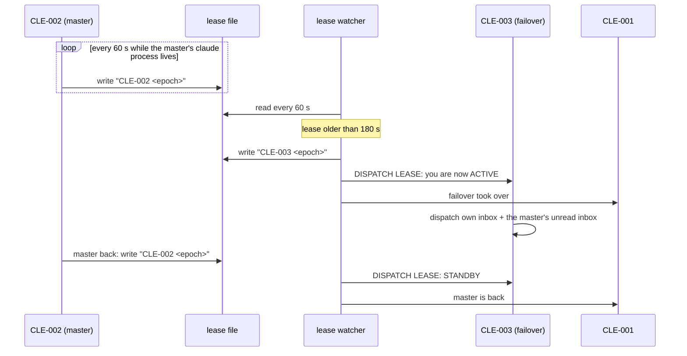

# Spool fleet roles: orchestrator and dispatchers

How the agents that run a box split the work of reading traffic, deciding, and
doing. Owner decision 2026-10-01: the orchestrator stops reading raw traffic;
two dispatchers (a master and a failover) route every message, and only
decisions reach the orchestrator.

## 1. Roles

| id | role | does | never does |
|---|---|---|---|
| `CLE-001` | orchestrator | decides; spawns, re-seats and closes agents; verifies "live" claims; runs the production operations agents' harnesses refuse (prd reads, prd desk and issue writes, deploys the owner pre-approved) | reads the raw message stream; routes routine traffic |
| `CLE-002` | master dispatcher | routes every inbound message to the lane that owns it; delivers agents' owner texts to their topics after checking the claim; escalates decisions to `CLE-001` | codes, commits, deploys, spawns, closes agents, decides |
| `CLE-003` | failover dispatcher | the same as `CLE-002`, but only while it holds the lease (section 4) | dispatches while on standby |
| `CLE-<n>` | lane agents | one brief each: build, test, land, prove live, report to `CLE-001` | route other lanes' traffic |

Every agent runs in **auto** permission mode on the current default model. The
spawner sets `--permission-mode auto`; the model comes from the agent user's
settings, and a relaunch (`restore-claude-plain.sh`) passes it explicitly
because `--resume` keeps the session's old model.

## 2. Where messages come from

| source | arrives as | first reader |
|---|---|---|
| web UI posts (owner, members) | a desk delivery: a spool message in the seated agent's inbox + a poke line in its pane | the dispatcher seated on that workspace's desk |
| terminal (agents' reports, peer handoffs, relays) | a v:1 spool message in `$SPOOL_ROOT/<id>/inbox/` + a poke line | the addressee: a dispatcher for traffic, `CLE-001` only for escalations |
| the owner's own terminal | typed into the orchestrator's pane | `CLE-001` |

The dispatchers are seated on every workspace desk the box serves
(`do_spl_desk_up DESK_AGENT=CLE-002`, and `CLE-003`). `CLE-001` stays seated
too, so a post that names it still reaches it.

## 3. The routing rule

For each message the lease holder does exactly one thing, then archives it:

| the message is | the dispatcher |
|---|---|
| a post about an area a live lane owns | forwards it verbatim, with topic and message id, to that lane |
| a status question | asks the owning lane for a one-paragraph status and posts it in the asker's topic |
| an agent's owner text ("post this in topic X") | checks the claim (section 3.1), then posts it verbatim with its screenshots |
| a decision, an approval, work no lane owns, anything needing a spawn, close, deploy or production action, or anything unclear | escalates to `CLE-001` in one message: who asked, where, the exact words, what it needs |
| a duplicate or chatter | archives it, no reply |

Ownership comes from the spool registry, the window names and the
orchestrator's lane table. A dispatcher never guesses an owner; it asks
`CLE-001`.

### 3.1 A "live" claim is checked before it is posted

A web UI change is live only when the served `build.json` commit contains the
agent's commit (`git merge-base --is-ancestor <sha> <served>`); a hub change is
checked the same way against `/version`. An unproven claim goes back to the
agent.

## 4. Master and failover: the heartbeat lease

- The lease is one line, `<holder> <epoch>`, in `$SPOOL_ROOT/dispatch/lease`.
  Only the holder dispatches.
- The **renew loop** is bound to the master's claude process id: when the
  process dies, renewal stops and the lease goes stale.
- The **watch loop** promotes the failover after 180 s without renewal and keeps
  the lease fresh in its name. When the master renews again, the watcher sends
  the failover `STANDBY`; the master's own renewal is the handback.
- On promotion the failover also works through the master's unread inbox,
  skipping what the master's outbox shows it already handled.
- Every transition is logged to `$SPOOL_ROOT/dispatch/lease.log` and reported to
  `CLE-001`.

## 5. What this replaced

Before 2026-10-01 the orchestrator read every message itself, a standing first
responder covered one workspace, and a relay agent forwarded posts from all
workspaces. Three paths meant duplicate routing and an orchestrator buried in
traffic. Both older agents retire once the dispatchers have routed a test post
end to end in every seated workspace.

## 6. Failure modes seen on 2026-10-01

| failure | effect | guard |
|---|---|---|
| a reboot restore resumed a neighbour's session in a window | pokes reached the wrong conversation; three lanes ran nowhere | the restore records each pane's session from the live process and refuses an inconsistent triple; a post-boot check compares window, env, cwd and transcript |
| registry rows kept pre-reboot pane ids; tmux reuses pane numbers after a restart | a re-run window rename renamed a neighbour's window | the registry is refreshed after every restore; a resolver checks that a pane still runs that agent before using it |
| the shared checkout lagged trunk | spawns re-installed a stale pre-push hook | spawn from an up-to-date worktree; the common hook execs the pushing worktree's own hook |

## 7. Status

| piece | state |
|---|---|
| `CLE-002`, `CLE-003` spawned (auto mode, current model) | live since 2026-10-01 |
| lease renew + watch loops | running from an interim script outside the repo; landing them as a run.sh action with tests, and starting them at boot, is open |
| dispatchers seated on every workspace desk | open |
| retiring the standing first responder and the relay agent | open, after the end-to-end test |

<!-- version: 0.1.0 · updated: 2026-10-01 · last-edit: 2026-10-01T04:45:00Z -->
