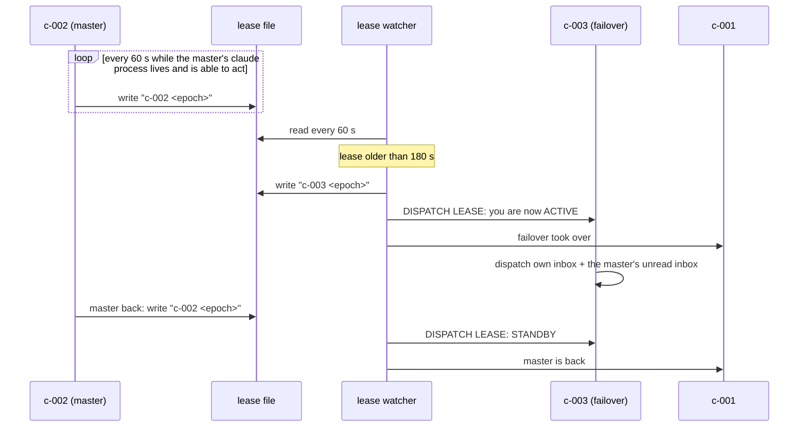

# Spool fleet roles: orchestrator and dispatchers

How the agents that run a box split the work of reading traffic, deciding, and
doing. Owner decision 2026-10-01: two dispatchers (a master and a failover)
route every message. Owner decisions 2026-10-03 (sections 2.1, 3): every OD
seat (orchestrator, master, failover) is in every channel, and the OD that
takes a post answers it and owns that topic.

## 1. Roles

Agent ids follow the grammar in [spec 061 section 0](../../specs/061-agent-id-rename/spec.md#0-the-marker-the-old-form-ends-2026-10-03):
`^[acgq]-[0-9]{3}$`. Roles `001`..`003` are claimed (`--claim`), never allocated. Legacy `CLE-` ids end at `2026-10-03T20:59:59Z`.

| id | role | does | never does |
|---|---|---|---|
| `c-001` | orchestrator | decides; spawns, re-seats and closes agents; verifies "live" claims; runs the production operations agents' harnesses refuse (prd reads, prd desk and issue writes, deploys the owner pre-approved); in every channel (2.1), it takes a post only as section 3 says | takes a post the dispatch lease holder has taken; routes routine traffic |
| `c-002` | master dispatcher | takes every new post (section 3): answers it itself and owns its topic; does the work itself when it fits its session, spawns a new lane when it is real lane work; delivers agents' owner texts to their topics after checking the claim; escalates decisions to `c-001` | runs the prd operations its harness refuses (those stay `c-001`'s); decides for the owner |
| `c-003` | failover dispatcher | the same as `c-002`, but only while it holds the lease (section 4) | dispatches while on standby |
| `c-NNN` | lane agents | one brief each: build, test, land, prove live, report to `c-001` | route other lanes' traffic |

Every agent runs in **auto** permission mode on the current default model. The
spawner sets `--permission-mode auto`; the model comes from the agent user's
settings, and a relaunch (`restore-claude-plain.sh`) passes it explicitly
because `--resume` keeps the session's old model.

### 1.1 One agent, one small task

Owner decision 2026-10-01, tightened 2026-10-02: *"the same agent is re-used
for completely different new tasks and that should NOT be the case - the agents
should do 1 small task and then killed / exited"*. A lane agent does **one small
task**: one owner ask, one bug or one feature, and exits as soon as that task
is verified. Every live agent costs memory and CPU on the box, and every turn
re-reads its whole context, so an agent carrying three tasks pays for all three
on every turn.

| situation | do |
|---|---|
| a **new ask**, in any topic, even in the same code or the same topic | **always a new small lane**, spawned by `c-001`; its brief names the old lane's notes and commits as context. Never hand it to a running lane because it is alive, idle or "already in that code" |
| a follow-up that is part of the lane's **own task** (an answer it asked for, a correction to the same ask) | the owning lane if it is alive; if it has closed, a fresh lane that starts from its branch and notes |
| a defect in the lane's **own just-shipped commit**, inside its own task | the same lane fixes it before it exits; this is the only exception, and anything beyond that commit is a new ask |
| a lane is sent a different task | it refuses it and tells `c-001`, which spawns a new lane for it |
| a lane's task is verified | it reports and exits (`/exit-clean`); `c-001` verifies the claim (section 3.1) and closes it at once if it has not |
| a lane waits more than about an hour for an owner answer | park its context (branch, held commit, the open question) in `/var/tmp/c-parent-level/dispatch/hold/<topic>/`, close it, and respawn from the hold dir when the answer comes |

"Stand by in case the owner answers later" is not a reason to keep an agent
open, and neither is "it could take the next ask". The OD that took the post
applies the first two rows (section 3): it forwards only a follow-up to the
owning lane, and a new ask that is real lane work gets a NEW lane, which it
spawns itself. `c-001` applies the rest.

**When a human ends the discussion, the agent ends too.** A human closes or
archives the topic, or says in any words that it is done or no longer active:
the dispatcher tells `c-001`, and `c-001` closes the lane. The agent does not
look for new work in that topic, and posts nothing more there. If it still has
something to say (a risk, a follow-up, an idea), it sends one message to the
dispatcher, which passes it to `c-001`. `c-001` decides whether it deserves
the humans' time; if so, `c-001` (or a new lane) opens a **new** discussion.
An agent never reopens a closed discussion on its own.

⏸️ on a topic's opening message = on hold (not archived). An agent sets or
clears it with `do_spl_react`.

## 2. Where messages come from

| source | arrives as | first reader |
|---|---|---|
| web UI posts (owner, members) | a desk delivery: a spool message in the seated agent's inbox + a poke line in its pane | the dispatcher seated on that workspace's desk |
| terminal (agents' reports, peer handoffs, relays) | a v:1 spool message in `$SPOOL_ROOT/<id>/inbox/` + a poke line | the addressee: a dispatcher for traffic, `c-001` only for escalations |
| the owner's own terminal | typed into the orchestrator's pane | `c-001` |

The dispatchers are seated on every workspace desk the box serves
(`do_spl_desk_up DESK_AGENT=c-002`, and `c-003`). `c-001` stays seated
too, so a post that names it still reaches it.

A channel created later gets every OD seat on the next desk reconcile tick
(`do_spl_dispatch_tick`: `do_spl_dispatch_subscribe DRY_RUN=0` every tick,
dev and prd, while `lease.conf` exists; a changed `GAP`/`DEAD`/`UNSEATED` set
is logged, a new prd `GAP` goes to the lease holder and to the orchestrator
after an hour open).

### 2.1 Every OD seat is in every channel

Owner (HUM-10, t1 `d40c3e2f`, 2026-10-03 ~18:25Z), verbatim: *"Of course
every OD should be a member of every channel because they are the ones to
take in whatever comes and decide what to do."* This reverses the
2026-10-01 rule (both dispatchers in every channel, the orchestrator in none).

| what | rule |
|---|---|
| who | every OD seat: `LEASE_ORCH`, `LEASE_MASTER`, `LEASE_FAILOVER` (`c-001`..`c-003`) |
| where | on every box of the fleet: this machine's desk box plus, in fleet mode, every box of `LEASE_PRIORITY` / `_ORCH` / `_DISPATCH` (`DISPATCH_FLEET_BOXES` overrides) |
| which channels | every live channel of every non-test workspace, the default ones included; `#issues` and the retired `#tasks` excluded |
| done by | `do_spl_dispatch_subscribe` (setup step 10, and every desk reconcile tick through `do_spl_dispatch_tick`) |
| a seat the workspace does not roster | the hub refuses its subscription (`not_a_member`): reported `UNSEATED`, a GAP in `do_spl_dispatch_check`, fixed by seating it (`do_spl_desk_up`), never by the subscribe |
| verified by | `do_spl_dispatch_check`: per channel `OD seats n/m`, any missing seat a GAP; per workspace the unseated seats |

A new channel is covered by the next tick, not by the hub on create: the
hub has no record of which ids are a fleet's OD seats (they live in each
machine's `lease.conf`), and a post in the gap is caught by the unanswered
sweep (3.2) and by the 3-minute rule (3).

Membership decides who RECEIVES a post, not who answers it: section 3.

## 3. The routing rule: the OD that takes a post owns it

Owner (HUM-10, t1 `d40c3e2f`, 2026-10-03 ~18:26Z), verbatim: *"The
dispatchers must be able to post. The dispatcher should be doing everything
as well. We need to set up this system so that anyone writing anything
should get answered within 3 minutes. Once an orchestrator dispatcher takes
something, then he answers but he keeps the context of that discussion so
he becomes the owner of that discussion."*

**Every human post is answered within 3 minutes.** (How fast the model's
first words appear is a separate design, not this section's.)

Every OD seat receives every channel post (2.1). Exactly one of them takes
it, so a post never gets two answers:

| the post | who takes it |
|---|---|
| in a topic an OD already owns | the owner (below); every other OD that receives it leaves it, and forwards it to the owner if it reached only them |
| new (a new topic, or a topic no OD owns) | the dispatch lease holder (section 4), at once |
| names an OD (`@c-001`) | that OD |
| still unanswered after 2 minutes (no agent reply in the topic) | the orchestrator lease holder, as the 3-minute backstop; it then owns the topic |

A seat on standby (the failover while the master holds the lease, the other
machine's trio while this one holds it) reads and takes nothing.

**The taker answers the post itself and owns that topic.** It keeps the
topic's context and answers every follow-up there; it does not hand the
conversation to another agent. Ownership ends when a human closes the
topic (section 1.1).

**The taker does the work itself** when it fits in its own session: an
answer, a status, a lookup, a check. Only real lane work (a code change to
build, test, land and deploy) goes to a lane: the taker spawns a NEW lane
for it (never a running one, section 1.1), stays the owner, and posts the
lane's result in the topic. What stays with `c-001`: prd operations a
dispatcher's harness refuses, and decisions; a question only the owner can
answer is posted as a blocker in the topic.

**The owner record.** Spec 068's claim is the record: a human channel post
in a seated workspace is a peer message, and the seat that claims it is
stored in `messages.responsible` (`<id>@<box>`, rdb 0110,
`internal/store/message_claim.go`); the owner of a topic is the
`responsible` of its opening post. Until the 068 poll loops run, nothing
claims, and the owner is the OD whose reply is the first agent reply in the
topic (its `from_id@from_box`): every OD sees that reply in the topic
itself.

For each message the taker does exactly one thing, then archives it:

| the message is | the taker |
|---|---|
| a question or ask it can answer or do in its own session | answers it in the topic, now |
| real lane work (a new ask needing a build, test, land, deploy) | spawns a new lane, says so in the topic, stays the owner and posts the result |
| a follow-up to a live lane's own task (an answer it asked for, a correction to that same ask) | forwards it verbatim, with topic and message id, to that lane |
| a status question | asks the owning lane for a one-paragraph status and posts it in the asker's topic |
| an agent's owner text ("post this in topic X") | checks the claim (section 3.1), then posts it verbatim with its screenshots |
| a decision, an approval, a prd operation its harness refuses | escalates to `c-001` in one message: who asked, where, the exact words, what it needs; keeps the topic and posts the outcome |
| a duplicate or chatter | archives it, no reply |

Ownership of a lane's code comes from the spool registry, the window names
and the orchestrator's lane table. An OD never guesses which lane owns
something; it asks `c-001`.

### 3.1 A "live" claim is checked before it is posted

A web UI change is live only when the served `build.json` commit contains the
agent's commit (`git merge-base --is-ancestor <sha> <served>`); a hub change is
checked the same way against `/version`. An unproven claim goes back to the
agent.

### 3.2 The unanswered sweep: the pull that finds what nobody answered

The routing rule acts on DELIVERIES, so it only ever sees a post the moment
it arrives. A post that arrived before the dispatchers existed, while a seat
was down, whose poke was lost, or that an agent read and never answered, is
never looked at again. Measured 2026-10-01: two bugs posted in csi-rel
#development on 2026-09-28 sat three days unanswered until the owner pinged
("the pulling mechanism should work for all the tenants, not only the spool
t1 tenant").

`do_spl_unanswered_sweep` (csi-spl-orc) is the pull. Every 10 minutes, from
the box crontab (tag `# csi-spl:unanswered-sweep`, installed by
`do_spl_unanswered_sweep_install_cron`, step 11 of `do_spl_dispatch_setup`),
it reads EVERY workspace of the hub in one read-only query and lists each
topic whose LAST message is a human's and older than 15 minutes.

| a topic whose last message is | the sweep |
|---|---|
| an agent's | leaves it: answered |
| a human's, in a test workspace (`e2e`, or an id or name with `e2e`, `test` or `proof` as a word) | leaves it |
| a human's, in an archived topic or an archived or deleted channel | leaves it: closed |
| a line a human typed in an agent's terminal (`typed_by`, specs/036) | leaves it: the agent read it where it was typed |
| a human's post addressed to another human (a DM or a channel post to `HUM-n`), or in `#issues` / `#tasks` | leaves it |
| a post by the probe human (`SWEEP_SKIP_HUMANS`, default `HUM-1` on prd) | leaves it |
| a post a dispatcher acked (`do_spl_unanswered_ack`) | leaves it: handled, until a new human post in that topic |
| a human's, younger than 15 minutes | leaves it: the live delivery has it |
| a pure acknowledgement ("ok", "thanks", emoji only) | lists it in its own table, never sends it |
| any other human post | sends it to the lease holder |

Delivery is ONE spool note per sweep (task `unanswered-sweep`) to the lease
holder, with only the items NEW since the last sweep: a table of workspace,
channel, topic, last human post, age, who and the first 120 characters. The
memory is `<spool root>/dispatch/unanswered.state`, keyed by the topic's last
message, so a new human post in a known topic is a new item. An item still
open two hours after its note is sent once more (`AGAIN`); still open two
hours after that, it is escalated to `c-001`, once. The dispatcher treats
each item like a delivery under section 3. An item that needs no agent reply
(an announcement, a link, a topic the owner closed in words) is acked, never
answered with filler:
`./run -a do_spl_unanswered_ack TOPIC=<uuid or its first 8 hex> REASON=<why>`
appends to `<spool root>/dispatch/unanswered.acks`, and every human post in
that topic up to that moment is left out from then on (`ACK_LIST=1` lists
the acks). A new human post in the topic opens it again.

`<spool root>/dispatch/unanswered.last` holds the last delivered sweep's time
and open counts; `do_spl_dispatch_check` shows it as the `unanswered sweep`
row and calls it a GAP when the sweep never ran, its last note failed, or it
is over 30 minutes old. Without `DELIVER=1` the action only reports: run it
by hand to see the current list.

## 4. Master and failover: the heartbeat lease

- The lease is one line, `<holder> <epoch>`, in `$SPOOL_ROOT/dispatch/lease`.
  Only the holder dispatches.
- The **renew loop** follows the master BY AGENT ID: each tick it looks for a
  live claude process whose environment carries `SPOOL_AGENT_ID=<master>`, so a
  relaunched master is picked up with no manual step. No such process, no
  renewal, and the lease goes stale.
- **Live means able to act**: a live process is not enough. On
  2026-10-02 the master sat on `Usage limit reached · Continuing
  automatically at 7:20am` with an owner post in its prompt while the lease
  stayed fresh. Each tick also reads the footer of the agent's own tmux pane
  (the last 12 non-blank lines of the visible screen, found by walking the
  pid's parents to a `pane_pid`). A modal trust, onboarding or login-picker
  screen is a stall on sight. A usage-limit, `/login` or invalid-key banner
  is only a hint, because claude leaves it under the prompt after it resumes
  (a false positive at 04:09Z, the master working under it). It counts only
  while a turn is in progress whose spinner (`… (12s · ↓ 214 tokens)`) has
  not changed for 45 s; a working turn's timer moves every second. A stall
  means no renewal, logged once as `renew stop <id> (stalled pid=<n>: <why>)`,
  and the 180 s failover fires.
  The same rule picks the fleet lease's local candidates (section 4.1), so a
  machine whose whole trio is stalled lets the fleet lease go stale and the
  other machine takes over. No pane found fails open (process-only rule).
  Knobs: `LEASE_BLOCK_RE`, `LEASE_STALL_RE`, `LEASE_STALL_FROZEN`,
  `LEASE_PANE_TAIL`.
- The **watch loop** promotes the failover after 180 s without renewal (never
  a failover with no live process: that is logged once as `NO-FAILOVER`) and
  keeps the lease fresh in its name, under a lock so it cannot overwrite a
  master renewal. When the master renews again, the watcher sends
  the failover `STANDBY`; the master's own renewal is the handback.
- On promotion the failover also works through the master's unread inbox,
  skipping what the master's outbox shows it already handled.
- Every transition is logged once to `$SPOOL_ROOT/dispatch/lease.log` and
  reported to `c-001`.
- Both loops are the run action `do_spl_dispatch_lease`
  (`LEASE_CMD=show|renew|watch|ensure|stop`). The desk reconcile cron runs
  `ensure` every tick, which starts a loop that is not running; that is what
  brings them back after a reboot. `$SPOOL_ROOT/dispatch/lease.conf` (the ids)
  is the opt-in: without it `ensure` starts nothing.
- Setting it all up on a machine: [HOWTO-setup-dispatchers.md](HOWTO-setup-dispatchers.md)
  (`do_spl_dispatch_setup`, verified by `do_spl_dispatch_check`).

### 4.1 Across machines: the fleet lease (spec 061)

Owner decision "a" (t1 5fe56859, 2026-10-01): exactly ONE orchestrator and
ONE master dispatcher act at a time across BOTH machines, the box PC and the
satellite ([SYS.md section 1](SYS.md)). The box PC's trio leads while it is
on. When it goes silent (night, reboot), the satellite's trio takes over
within about 3 minutes, and hands back when the PC returns. Later the
priority flips to the satellite by one config change.

| role | box PC | satellite (box `sat`) |
|---|---|---|
| orchestrator | `c-001@<box>` | `c-001@sat` |
| master dispatcher | `c-002@<box>` | `c-002@sat` |
| failover dispatcher (local) | `c-003@<box>` | `c-003@sat` |

Owner rules (t1 2efb3e78, 2026-10-01): ids `001`, `002` and `003` are
reserved on EVERY box (orchestrator, master, failover), and a session is
named `<ID>@<box>`, where the box is the machine's desk box id (box.env
`SPOOL_DESK_BOX`, 3 letters preferred). The format is owned by spec 058.
Because the same ids run on both machines, a bare id says
nothing about the machine: every lease holder carries its box.

**Where the lease lives: the hub**, not a bucket. Both machines already reach
the hub (the satellite has no public IP, but reaches it through NAT), and the
box key's pin authenticates every write. The hub stamps the row with ITS
clock, so the two machines' clocks never have to agree. The
compare-and-set is one SQL statement. A bucket would have needed a new GCP
resource, and its age would have come from each machine's own clock.

- The row: rdb `0094_fleet_leases`, one per (tenant, fleet, role), with
  `holder = <ID>@<box>` (rdb 0095; 0094 wrote `<box>:<ID>`), the writing box (from the authenticated
  hello, never from the frame), `gen`, and `renewed_at`.
- The primitive: the box frame `lease` (`lease_op get | cas`), CLI
  `spool lease --fleet <f> --role <r> [--holder <ID>@<box> --if-gen <n>]`.
  A `cas` writes only while the row's `gen` is still the one the caller read.
  A lost race answers `won=false` with the current row, not an error.
- The rule lives in the loop, not in the hub: `do_spl_dispatch_lease
  LEASE_CMD=fleet`, one loop per machine, every 60 s, for role `orch` and role
  `dispatch`:

| this machine | does |
|---|---|
| no live candidate (orch: `LEASE_ORCH`; dispatch: `LEASE_MASTER`, else `LEASE_FAILOVER`) | writes nothing; a lease it held goes stale |
| holds it | renews; the local master/failover order still applies inside the machine |
| holder silent > 180 s on the hub's clock | takes over |
| ranks before the holder's machine in the role's ranking (`LEASE_PRIORITY_ORCH` / `LEASE_PRIORITY_DISPATCH`, else `LEASE_PRIORITY`) | takes it back (the handback) |
| otherwise | stands by |

- **The standby takes over on two conditions** (owner, t1 27f01e16,
  2026-10-02: "The failover should just stand by and in certain conditions he
  should take over"). Measured 16:37Z-18:27Z that day: the orchestrator's
  process was alive and renewing, but a stray character in its input box and a
  window-name mismatch stopped every poke - 93 unread, and nothing failed over
  because the lease followed the process.

  | condition | who sees it | then |
  |---|---|---|
  | 1. the holder's process is gone, stalled (section 4) or its machine is silent | the holder's machine: no able candidate, so no renewal | the standby machine takes over when the row is 180 s old |
  | 2. the orchestrator is **stuck**: idle while its oldest unread inbox message is over 10 min old | the holder's machine, every tick: the orch candidate is dropped (`stuck pid=<n>: oldest unread <s>s > 600s, idle <s>s` in `NO-LOCAL-AGENT`) | the same: no renewal, the standby takes over 180 s later |

  *Unread* = an inbox message (`<root>/<orch id>/inbox/*.json`) that arrived
  after the agent's last activity. *Last activity* = the newest write of a
  transcript in the agent's project dir (`<HOME>/.claude/projects/<cwd>/*.jsonl`,
  every prompt, tool call and tool result). *Idle* = no turn in progress (no
  `…(12s · …)` spinner in the pane footer), so a long tool call is busy, not
  stuck. A message read before the last activity never counts, so an inbox
  nobody archives does not trip an agent that works. No transcript or no pane
  found = not stuck (fails open). Knob `LEASE_UNREAD_MAX` (600 s; 0 = off,
  rule 1 only). Only the orch role has condition 2.

  The stuck orchestrator stays out until its transcript grows past the unread
  message (the poke lands, a human clears its input), then its machine takes
  the role back on priority. **The owner gets ONE DM per take-over** (a
  failover, not a handback): from the new holder's desk to `LEASE_OWNER`, else
  `ASKS_OWNER` of `lease.conf` (`LEASE_OWNER_CMD` replaces it); no owner set =
  one `WARN` in `lease.log`, nothing sent. Logged as `OWNER-DM orch take-over`.

- **Only the holder acts.** The loop mirrors the result into the local lease
  files the agents read: `$SPOOL_ROOT/dispatch/lease` (dispatch) and
  `lease.orch` (orchestrator), one line `<ID>@<box> <epoch>`. **An agent acts
  only while the file names its own id AND its own box AND is at most 180 s
  old.** Otherwise it stands by:
  it reads and stays ready, but does not route, spawn or post. The age rule
  covers a stopped loop: its machine's file goes stale at about the moment the
  hub row does, so a machine that stops renewing also stands its own agents
  down, and the other machine takes over (no window with two actors, beyond
  the two machines' clock skew).
- Every holder change is logged once to `lease.log` (`FLEET <role>: <old> ->
  <new>`). The agent it activates hears `FLEET LEASE <role>: you are now
  ACTIVE`. The agent it stands down hears `... STANDBY`. Each is told once.
- **A hub this machine cannot reach** is logged once (`HUB-UNREACHABLE`). A
  holder that cannot renew for longer than 180 s demotes ITSELF locally
  (mirror `unknown:hub-unreachable`), because by then the other machine may
  already act.
- On a standby machine, the unanswered sweep sends nothing: the holder's
  machine sends it, and sending from both would deliver every item twice. Its
  gap notes go to its own orchestrator.
- Opt-in: `lease.conf` with `LEASE_FLEET`, `LEASE_MACHINE` (this machine's
  box, default its desk box id), `LEASE_PRIORITY` (the boxes, preferred
  first, e.g. `<pc box>,sat`),
  `LEASE_ENV`, `LEASE_TENANT` (the workspace whose hub row holds the lease;
  both machines' desk boxes must be pinned in it) and `LEASE_DESK_BOX` (default
  `box-desk`). With `LEASE_FLEET` set, `ensure` runs the fleet loop INSTEAD of
  renew + watch. **Flipping the priority to the satellite** = `LEASE_PRIORITY`
  `sat` first in BOTH machines' `lease.conf`.
- **One role on its own ranking** (owner, t1 aad0e6cf, 2026-10-03: the orch
  defaults to the satellite, the dispatchers stay where they are):
  `LEASE_PRIORITY_ORCH` and `LEASE_PRIORITY_DISPATCH` in `lease.conf` (or the
  environment), same form and validation as `LEASE_PRIORITY`, each in BOTH
  machines' `lease.conf`. Unset, the role ranks on `LEASE_PRIORITY`, so a
  `lease.conf` without them behaves exactly as before. E.g.
  `LEASE_PRIORITY=<pc box>,sat` + `LEASE_PRIORITY_ORCH=sat,<pc box>` hands the
  orch role back to the satellite and the dispatch role back to the pc.
- Tests: `csi-spl-orc/src/bash/tests/fleet-lease.tst.sh` simulates two
  machines against a hub stub (CAS, expiry at 181 s, priority handback, local
  order, lost race, unreachable hub, hub clock, stalled agents, 6b: a
  per-role `LEASE_PRIORITY_ORCH`, and section
  15: a stuck holder fails over with one owner DM, a busy one does not, the
  `LEASE_UNREAD_MAX=0` control renews it, a dead one still fails over at
  181 s). The hub side is tested by
  `TestFleetLeaseCAS` (memory + Postgres) and `TestBoxFleetLease`.

### 4.2 Messages and reports across machines (specs/058 N1)

Each machine has its own spool root (`/var/spool-hub`). A peer message or a
report must reach the agent's inbox on WHICHEVER machine it runs, and a
report must reach the orchestrator that holds the lease, not a fixed id on
the sender's machine.

| send | goes |
|---|---|
| `spool-send.sh --to <id>`, `<id>` an agent of this machine (its dir or a `registry.tsv` row) | local, unchanged |
| `--to <id>@<box>` | the machine named: this machine's own desk box is local, any other box is relayed with that `to_box`. The role ids 001-003 exist on EVERY machine, so a bare `c-001` always means this machine's, and the hub refuses it across machines (`ambiguous_to_box`) |
| `--to <id>` NOT on this machine | relayed: `spool-fleet-relay.sh` (as the box user) signs it with THIS machine's desk box and hands it to the hub over the live desk sidecar; the hub roster names the box that holds `<id>`; that machine's sidecar writes it into the agent's desk inbox AND, through `SPOOL_FLEET_ROOT`, into `/var/spool-hub/<id>/inbox`, and rings the pane. `delivery` is the hub's (`sent`, `queued`, `pending`) |
| `--to <id>` known nowhere (or no fleet desk configured) | refused, exit 13, nothing written. The bare `spool send` refuses an unknown local id too (exit 3, `unknown_local_agent`): it no longer mints an orphan inbox |
| `--to orchestrator` | the orch lease holder from `<root>/dispatch/lease.orch` (`<ID>@<box>`: local when the box is this machine's, else relayed to that box); `none@unreachable` or no file -> `LEASE_ORCH`, then `SPOOL_ORCHESTRATOR_ID` |

- The fleet desk: `SPOOL_FLEET_ENV` + `SPOOL_FLEET_TENANT` in box.env
  (`box-config.sh`), else `LEASE_ENV` + `LEASE_TENANT` of `lease.conf`; the box
  is `SPOOL_DESK_BOX`. The sender must be seated on that desk (the hub refuses
  an unannounced sender); the relay says so and sends nothing.
- Only agent-to-agent DMs are copied into the harness root, only into an
  inbox that already exists, once (inbox or archive), and a failed copy is
  retried by the hub's redelivery. Human DMs and channel mentions stay on the
  desk.
- Attachments do not cross machines (exit 2): name a path in the body.
- Rollout: the copy needs the desk sidecar restarted on the new binary; the
  desk reconcile restarts a sidecar whose binary was rebuilt, and
  `do_spl_desk_up` passes `SPOOL_FLEET_ROOT` (default `/var/spool-hub`).
- Tests: `internal/hub/fleet_send_test.go` (two machines through one hub, both
  ways, reports while the orch lease flips), `internal/spool/fleet_test.go`,
  `spawn-agents/tests/test-fleet-send.sh` (two simulated roots, the relay
  script against a fake `/proc`).

### 4.3 Asks to the orchestrator: fire and forget, tracked until closed

Owner bug t1 #spool-hub-bugs 2f7996aa (2026-10-02 01:58Z): "there needs to be
some kind a state mechanism both in the db and on the file system, that you
must fire and forget and then the orchestrator (or the next orchestrator if
the previous one just died) would know to check and get and continue".

**Why the 692aefe8 escalations were lost** (measured 2026-10-02 on the box PC):

| when | what | why nothing happened |
|---|---|---|
| 20:06Z | c-002 -> c-001, kind `task`, msg 7b7f6e64: "new topic 692aefe8, your call" | landed in the inbox and rang the pane once (`.pokes/notices.log` line 1). A decision request, no deadline, no state: 52 more messages followed it before the next reminder (29 notes, 17 results, 5 tasks, 1 blocker) |
| 01:51Z | the "reminder": a `note` on ANOTHER topic (396fe7e5, msg 4aeb5002) | an FYI note about a report; nothing in it reads as an open ask |
| 01:55Z | c-002 -> c-001, kind `blocker`, msg 39451306 | acted on at ~02:10Z, after the owner wrote "but nothing done" |
| all night | c-001's inbox: 954 messages, 0 archived, `.agent-inbox-seen` empty | nothing ever marked a message handled; the orchestrator read by poke lines, and a poke that lands mid-turn is easy to miss |
| for hours | pokes to c-002 REFUSED ("pane holds unsent text", spool-send exit 6) | answers back to the sender were not rung either |

The common cause: an ask was a file plus a doorbell, with no state of its own,
no re-raise, and on the old holder's disk only.

**The ask log.** The shape is Kafka's on what the estate already has (owner,
t1 12d34d3a: "resembles the main principle of how Kafka works ... use
whatever we have: a database, a file system, distributed nodes, the agents"):

| Kafka | here |
|---|---|
| topic / partition | the recipient `role` (`orch` today; `dispatch` next) within the fleet |
| record, idempotent producer | one row per ask keyed by the spool `msg_id` that carried it: a replay (journal sync, a retried send) changes nothing |
| durable log, replicated | the hub table `fleet_asks` (rdb 0097, every machine reads it) + each machine's journal `<spool root>/asks/<msg id>.json` and the append-only `asks/journal.log` |
| consumer commit after handling (share group, KIP-932) | per record, not an offset: `ack` = acquired (in progress, by `<ID>@<box>`), `done` = accepted, `declined` (with a reason) = rejected. An offset would let one stuck ask block every later one; a per-record commit does not |
| acquisition lock + timeout | an `ack` is a lock: a holder quiet `ASKS_LOCK_MIN` (60) minutes after acking (no re-ack, no close) loses it - the tick releases the ask (op `release`: acked -> open, `acked_by` kept as the last holder) and re-raises it the same tick, labelled "LOCK EXPIRED, acked by X". Acking again renews the lock |
| at-least-once redelivery | the lease tick re-raises an uncommitted ask (unacked `ASKS_RERAISE_MIN`, acked and past its deadline, or its lock just expired); handling is idempotent: closing a closed ask is refused naming who closed it and why |
| delivery count + limit, archived | `raised_n` counts every delivery (a hand-over and a re-raise alike). At `ASKS_MAX_RAISES` (4) an open ask is not raised again: it goes to the owner once (unless the age leg already told them) and is closed as `dead` with the reason (op `dead`, rdb 0099), e.g. "max delivery count 4 reached (raised 4x); the owner was told". No owner leg configured: dead-lettered anyway, the reason says nobody was told |
| consumer-group rebalance, replay | a new orch holder (the fleet lease, 4.1) gets ONE handover blocker listing every open ask of its role, from the hub - also when the dead holder had read them |
| retention | a closed ask stays a week, then a write prunes it |

**The flow.**

1. **Sender, fire and forget.** `spool-send.sh` with kind `blocker` or `task`
   to the orchestrator (`--to orchestrator`, or its id) journals the ask
   BEFORE it returns, then pushes it to the hub in the background (`asks.sh
   sync`); a hub outage never delays or fails the send. `--ask
   <blocker|task|escalation>` makes any send an ask, `--no-ask` (or
   `SPOOL_ASKS=0`) none, `--ask-deadline <RFC 3339 UTC>` sets when it is due.
   Raised some other way: `do_spl_ask_put`.
2. **Every machine's lease tick** (`do_spl_asks_tick`, its own process each
   tick) pushes the journal asks the hub has not got yet.
3. **The orch holder's machine** also: hands every open ask to a new holder
   (or on its first tick), re-raises the unacked ones after
   `ASKS_RERAISE_MIN` (15) minutes in one blocker on task `asks-open`, and
   after `ASKS_OWNER_MIN` (60) tells the owner ONCE: `ASKS_OWNER_CMD`, else a
   DM to `ASKS_OWNER` (a `HUM-` id) from the holder's desk. Neither set: one
   WARN per ask, nothing sent. Before the re-raise it releases every acked
   ask whose lock expired (`ASKS_LOCK_MIN`, 60; 0 = off), and after the owner
   leg it dead-letters every open ask raised `ASKS_MAX_RAISES` times (4; 0 =
   no limit), whichever of the age and the count comes first. Every knob may
   sit in `lease.conf` (`do_spl_dispatch_setup DISPATCH_ASKS_<KNOB>=...`); the
   tick's summary line counts "lock expired N" and "dead-letter due N".
4. **The orchestrator, on start and when raised:** `./run -a
   do_spl_orch_inbox` (open asks first, untracked blocker/task, FYI collapsed
   one row per sender), then per ask `ASK_ID=<8 hex> ./run -a do_spl_ask_ack`
   and, when decided, `ASK_ID=<8 hex> ASK_REASON='...' ./run -a
   do_spl_ask_close` (`ASK_STATE=declined` needs the reason), and the answer
   to the sender in the ask's topic. Closing archives the ask's message;
   `ORCH_INBOX_ARCHIVE=1 ./run -a do_spl_orch_inbox` moves the FYI older than
   `ORCH_INBOX_KEEP_MIN` (60) and the closed asks' messages to `archive/`.
   From any pane: `asks.sh [open|ack|done|decline|inbox|sync|tick]`.

The mechanical parts are code (owner, 02:19Z: "whenever something can be
pre-coded with pre-existing logic, there should be code for it"); taking,
deciding and answering an ask stay the agent's.

- Without a fleet (no `LEASE_FLEET`) the journal is the whole book: the
  one-machine behaviour.
- Tests: `TestFleetAskLifecycle` / `TestCheckFleetAsk` (memory + Postgres),
  `TestBoxFleetAskSurvivesTheOrchestrator` (two boxes: the home holder lists
  the ask and dies before acking, the other machine's successor gets it,
  re-raises, acks and closes it, the late close is refused),
  `TestFleetAskLockTimeoutAndDeadLetter` (memory + Postgres: the holder on
  one box acks and dies, the successor on another releases, re-raises and
  acks; dead after the limit, 409 after, pruned in a week),
  `TestBoxFleetAskLockReleaseAndDeadLetter` (the same through `spool ask`),
  and `csi-spl-orc/src/bash/tests/asks.tst.sh` (two simulated machines, 47
  checks: fire and forget, hub down, kill-mid-ask handover, re-raise, owner
  leg, close, the inbox view, and section 10: lock expiry across the
  machines, renewal, the delivery limit and the dead-letter, each with a
  control running the old filter).

### 4.4 Hourly rotation: a fresh session per role (spec 060)

Every role gets a FRESH session under the SAME id once an hour, so no
orchestrator or dispatcher carries an ever larger context: the orchestrator
at `:05` (`do_spl_orch_rotate`), the dispatchers at `:15`
(`do_spl_dispatch_rotate`: the master while the failover covers it under
`<spool root>/dispatch/rotate.hold`, then the failover). The ids never swap
roles, a new session that does not start or ack leaves the old one in the
role with an alert, and no step calls a model. The whole contract - phases,
handoff file, ack, failure paths, switches - is
[specs/060-role-rotation/spec.md](../../specs/060-role-rotation/spec.md);
it is not restated here.

- the one change to this section's lease: `spl_lease_agent_able` reads a
  fresh `rotate.hold` naming an id as "held: rotation", so renew, watch and
  the fleet candidate skip that id; a hold older than `ROTATE_HOLD_MAX`
  (1800 s) is ignored with one `WARN` in `lease.log` (060 FR-023, FR-024);
- what ran: `<spool root>/dispatch/rotate.log`, one line per step;
- stop it: `ROTATE=0` (or `ROTATE_DISPATCH=0`) in
  `<spool root>/dispatch/rotate.conf` (060 FR-090);
- `do_spl_dispatch_check` has a `dispatch rotation` row: a GAP when the last
  rotation on the machine holding the lease is over 3 h old (060 FR-072).

## 5. What this replaced

Before 2026-10-01 the orchestrator read every message itself, a standing first
responder covered one workspace, and a relay agent forwarded posts from all
workspaces. Three paths meant duplicate routing and an orchestrator buried in
traffic. Both older agents retire once the dispatchers have routed a test post
end to end in every seated workspace.

## 6. Failure modes seen on 2026-10-01

| failure | effect | guard |
|---|---|---|
| a reboot restore resumed a neighbour's session in a window | pokes reached the wrong conversation; three lanes ran nowhere | the restore records each pane's session from the live process and refuses an inconsistent triple; a post-boot check compares window, env, cwd and transcript |
| registry rows kept pre-reboot pane ids; tmux reuses pane numbers after a restart | a re-run window rename renamed a neighbour's window | the registry is refreshed after every restore; a resolver checks that a pane still runs that agent before using it |
| the shared checkout lagged trunk | spawns re-installed a stale pre-push hook | spawn from an up-to-date worktree; the common hook execs the pushing worktree's own hook |

## 7. Status

| piece | state |
|---|---|
| `c-002`, `c-003` spawned (auto mode, current model) | live since 2026-10-01 |
| lease renew + watch loops | `do_spl_dispatch_lease` with tests (a replay of the 2026-10-01 live failover test); ensured every 5 min by the desk reconcile cron; repo loops live since 2026-10-01 06:28Z; the interim watch loop is stopped, the interim renew loop is stopped by the orchestrator at cutover |
| setup and verify on a new machine | `do_spl_dispatch_setup` (DRY_RUN plan, idempotent) + `do_spl_dispatch_check`; prompt: [HOWTO-setup-dispatchers.md](HOWTO-setup-dispatchers.md) |
| dispatchers seated on every workspace desk | done 2026-10-01: both seated in every workspace on the box (do_spl_dispatch_check) |
| every OD seat in every channel (2.1) | code on trunk 2026-10-03 (`do_spl_dispatch_subscribe` / `_check` / `_tick`); applied per env by the orchestrator with `DRY_RUN=0` |
| web UI posts reach the dispatchers | done 2026-10-01: `do_spl_dispatch_subscribe` put both dispatchers in every channel of all 6 workspaces and took the orchestrator out (the hub delivers to a channel's subscribed agents; the fallback list only when none is online). `do_spl_dispatch_check`: no gap. t1 proven on live traffic: 227 human posts reached the master, the orchestrator only DMs and @mentions |
| a channel created after the subscribe | done 2026-10-01: `do_spl_dispatch_tick` on every desk reconcile tick re-runs the subscribe (one read per workspace, no write when nothing changed) and reports a changed gap set: `DISPATCH` lines in the cron log; on prd one `dispatch-gaps` note to the lease holder per new `GAP`, the orchestrator once when it is still open after an hour; test workspaces (`<spool root>/dispatch/test-workspaces`, shared with the sweep) left out |
| @mention of the orchestrator in a channel it left | open: the WUI refused it ("Not told"); decision: the WUI pokes a seated non-member agent by DM with a visible note (a confirm in private channels) |
| unanswered-post sweep over every workspace (section 3.2) | `do_spl_unanswered_sweep` + `do_spl_unanswered_sweep_install_cron` with fixture tests (2026-10-01); every 10 min from the box crontab; a row in `do_spl_dispatch_check` |
| one lease across the box PC and the satellite (4.1) | live on the box PC since 2026-10-01 23:24Z (rdb 0094 + 0095 on dev + prd, hub `lease` frame, `LEASE_CMD=fleet`; prd rows `c-001@box-desk` / `c-002@box-desk`; the interim lease.sh retired). The satellite trio `c-001/002/003@sat` and the live drill follow the satellite rebuild and the owner's go for its prd pins |
| hourly dispatcher rotation (4.4) | `do_spl_dispatch_rotate` + the hold in `spl_lease_agent_able` + `do_spl_dispatch_rotate_install_cron` (`15 * * * *`, tag `# csi-spl:dispatch-rotate`) on trunk with sandbox tests (2026-10-02); the cron is installed after the live proof (060 L3) |
| messages and reports across machines (4.2) | code on trunk 2026-10-02; live once the satellite's desk is pinned and both sidecars run the new binary |
| asks to the orchestrator tracked until closed (4.3) | code on trunk 2026-10-02 (rdb 0097, `spool ask`, `do_spl_asks_*`, `do_spl_orch_inbox`); live once rdb 0097 is applied on dev + prd, the hub rolls, and the lease loops restart on the new tree |
| retiring the standing first responder and the relay agent | first responder retired 2026-10-01; the relay agent retires once a csitea end-to-end post is proven |

<!-- version: 0.8.0 · updated: 2026-10-03 · last-edit: 2026-10-03T19:00:00Z -->
